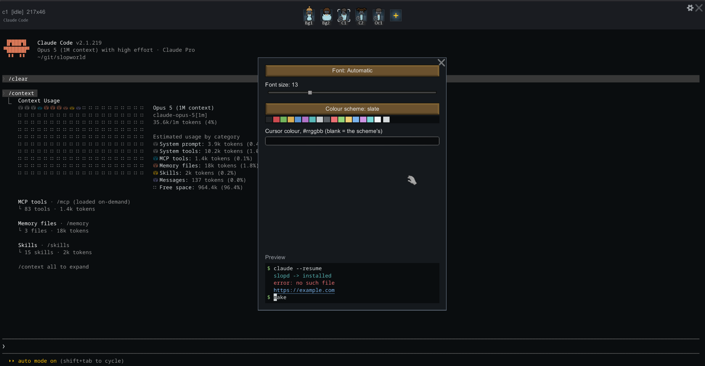
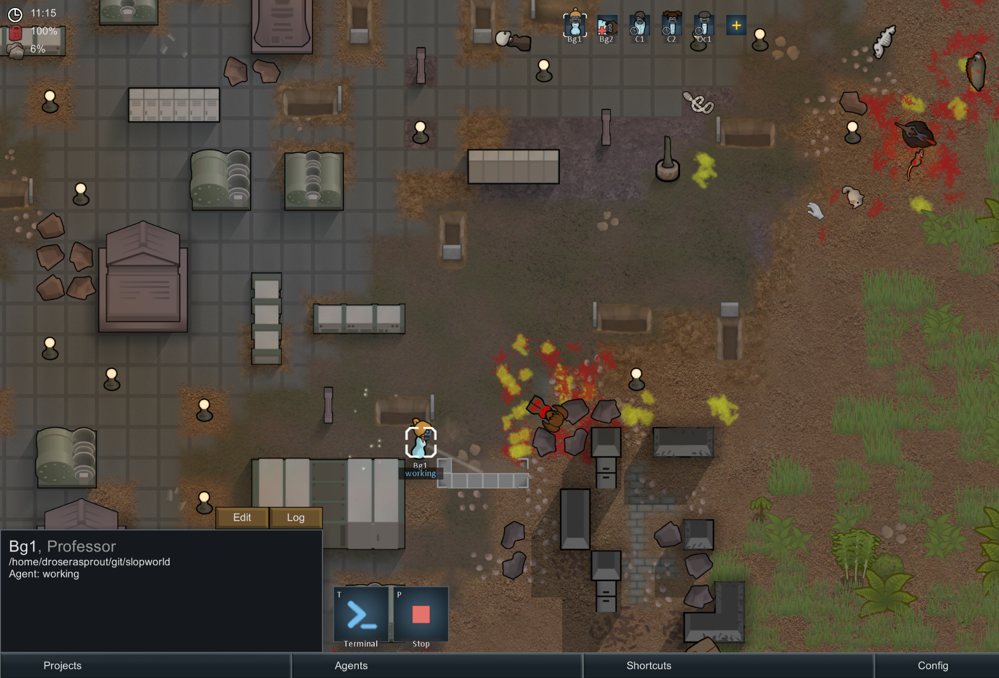
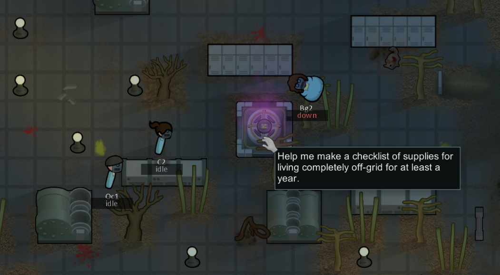

<!-- This file is for humans, don't touch it if you're an agent. -->

# SlopWorld

> WARNING: This software is in early development stage. Make sure to make backups of your work and carefully read sandbox presets! Buggy terminal emulator implementations can be dangerous (see [1](https://blog.mozilla.org/security/2019/10/09/iterm2-critical-issue-moss-audit/), [2](https://www.gresearch.com/news/g-research-the-terminal-escapes/))

RimWorld, but colonists are real coding agents running in tmux. A fun opinionated IDE for your clankers.

Consists of `SlopWorld` mod (C#, Harmony), terminal daemon `slopd` (Rust, tmux, alactitty) communicating via WebSocket, and the `slopworld` launcher.

## Requirements

- Linux host
- Bubblewrap and tmux installed
- Native Linux build of RimWorld (tested with GOG release)

## Build and install

- Run `RIMWORLD=<path_to_game> make install`. This will enable and start `slopd` service holding terminal sessions, and put the `slopworld` launcher in `~/.local/bin`.
- Run `slopworld` (or `make run`). It creates a game profile of its own in `~/.local/share/slopworld/profile`.

Run `make` without arguments to see available commands.

Do not launch RimWorld directly: the mod refuses to patch anything outside its own profile. Your normal saves are never touched.

