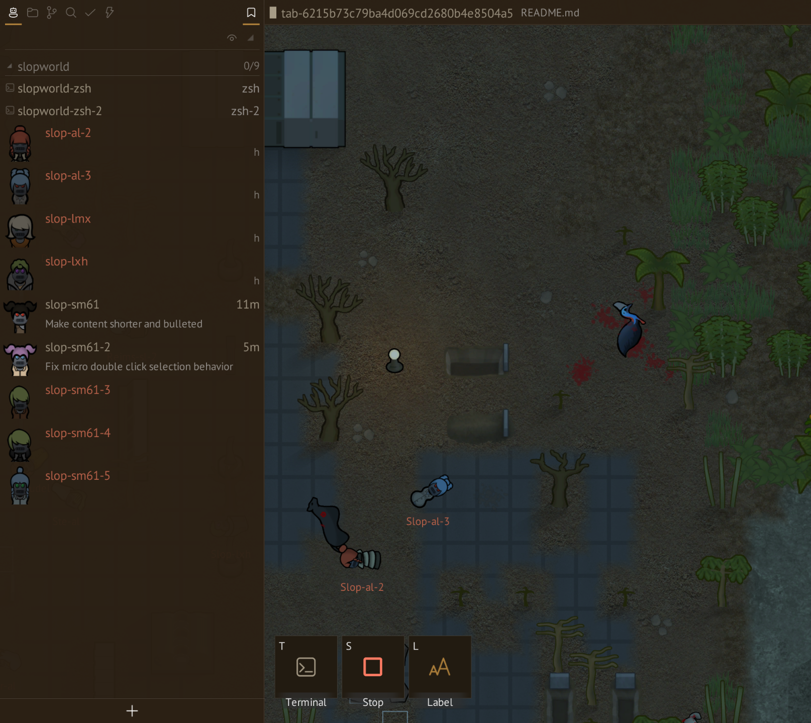
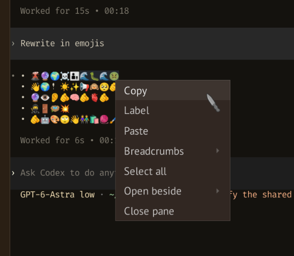
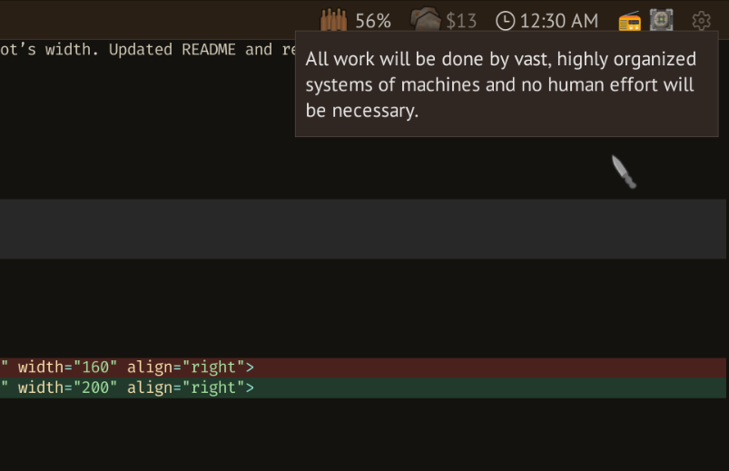
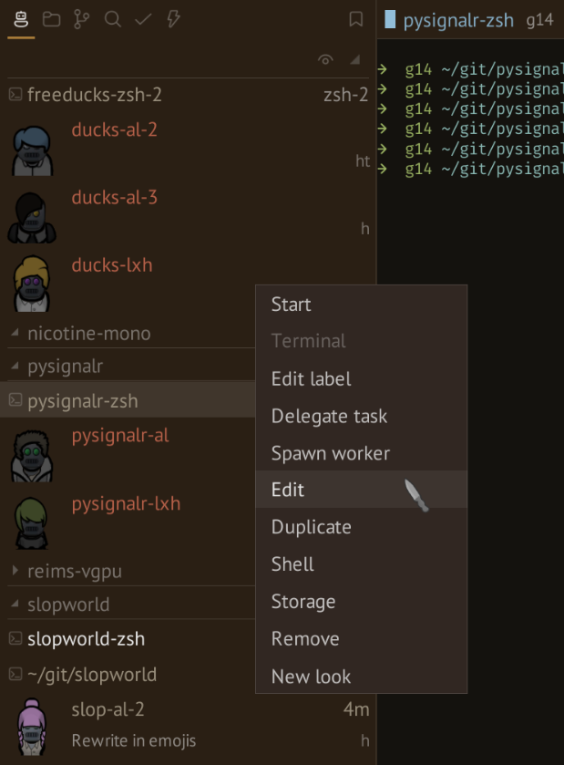
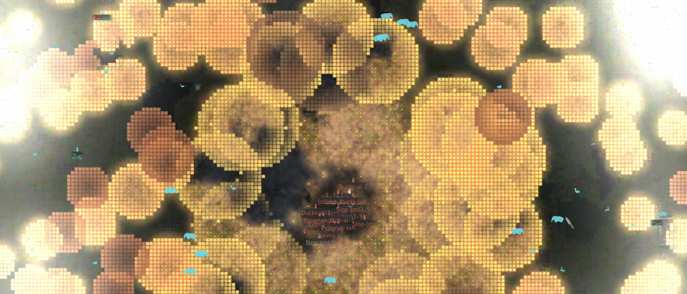

<p align="center">
  
</p>

<h1 align="center">SlopWorld</h1>



SlopWorld is a fun terminal-focused IDE for agentic coding, built on RimWorld.
Your agents' sessions appear as colonists. Select one to open its terminal and give
it work.

- Run agent CLIs, shells, and tools in persistent terminal sessions.
- Manage projects, mounts, and Git worktrees for parallel work.
- Configure sandboxing and network access per agent.
- Browse files, search code, review diffs, and commit changes.
- Hand off tasks between agents and track completion.
- Customize fonts, colors, and the UI layout.
- Enjoy the original soundtrack or tune to internet radio.

## What's inside



Your favorite Linux tooling, well-integrated:

- **Alacritty** for terminal emulation.
- **tmux** for multiplexing and persistent sessions.
- **Bubblewrap** for sandboxing and controlling filesystem access.
- **pasta** for networking in private sandboxes.
- **git** for version control and worktrees.
- Small UNIX friends: pagers, highlighters, ripgrep, git-delta.

SlopWorld consists of three components:

- A Rust daemon, `slopd`, manages the sessions and sandboxes.
- The RimWorld mod, `io.drsr.slopworld`, puts their terminals and status into the game interface.
- `slopctl` provides a command-line interface to the daemon's API.

## Get started



You need a native build of **RimWorld 1.6**, preferably the latest one. Buy the game
on [Steam](https://store.steampowered.com/app/294100/RimWorld/),
[GOG](https://www.gog.com/en/game/rimworld), or
[directly from Ludeon Studios](https://rimworldgame.com/).

For Linux host, see the [requirements](docs/src/installation/linux.md#requirements) and
[installation guide](docs/src/installation/linux.md).

For experimental sidecar mode (`slopd` in Docker) follow the [macOS](docs/src/installation/macos.md)
and [sidecar worker](docs/src/installation/sidecar.md) guides.

### From binaries

Binary packages for Arch and deb-based distros are published to [GitHub Releases](https://github.com/droserasprout/slopworld/releases).

See the [installation instructions](docs/src/installation/linux.md)
for installing a package, attaching the mod, and starting the daemon.

### From source



Install the [`just`](https://github.com/casey/just#installation) command runner
and the other [build prerequisites](docs/src/development/build.md#prerequisites).

```sh
git clone https://github.com/droserasprout/slopworld.git
cd slopworld
RIMWORLD=/path/to/RimWorld/game just install
slopworld
```

`RIMWORLD` defaults to `~/GOG Games/RimWorld/game`.

Always start the "game" with `slopworld`. The mod only activates in a separate profile and should stay disabled in vanilla installation.

## License



SlopWorld is licensed under [MIT](LICENSE). Bundled third-party components
and assets retain their own [licenses and attribution](licenses/README.md).

> “Portions of the materials used to create this content/mod are trademarks and/or copyrighted works of Ludeon Studios Inc. All rights reserved by Ludeon. This content/mod is not official and is not endorsed by Ludeon.”
