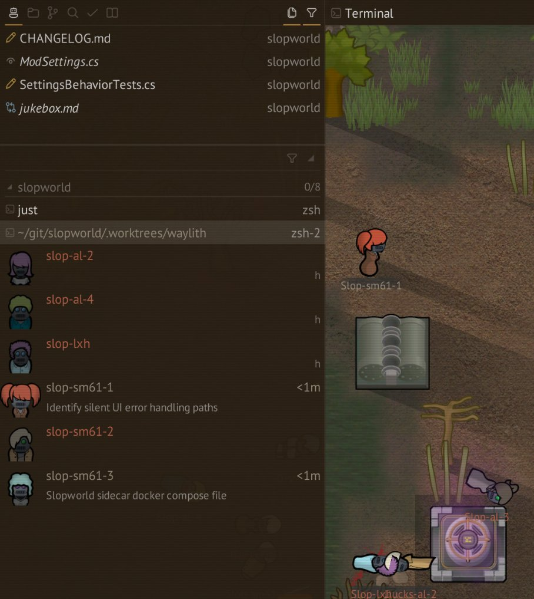
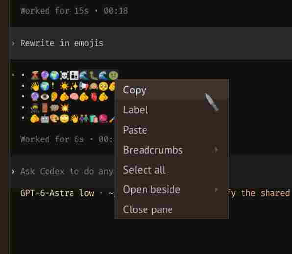
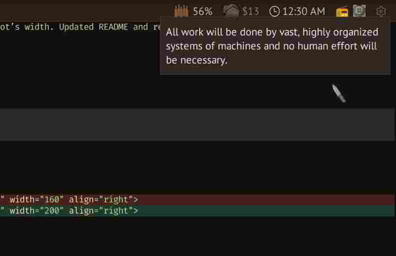
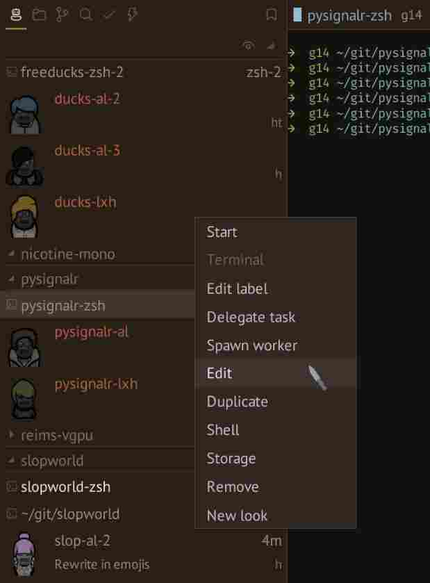
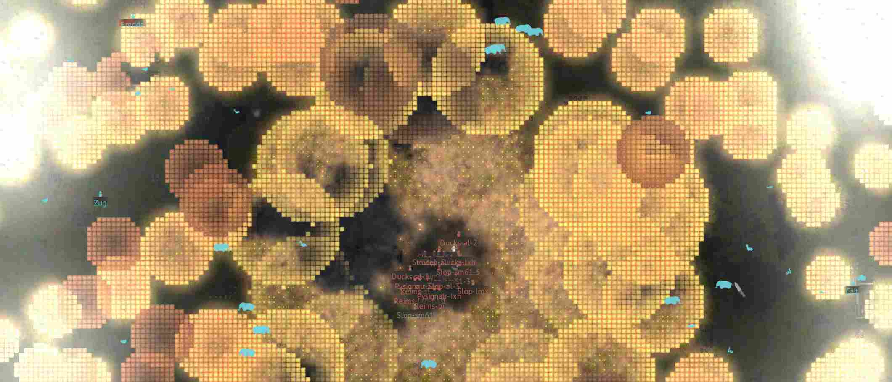

<p align="center">
  
</p>

<h1 align="center">SlopWorld</h1>



SlopWorld is an IDE and terminal multiplexer for coding agents built on RimWorld.

- Run [agent CLIs](https://slopworld.space/agents/configuring-agents.html), [shells](https://slopworld.space/terminals/host-shells.html), and tools in [persistent terminal sessions](https://slopworld.space/terminals/terminal.html).
- Manage [projects](https://slopworld.space/workspace/configuring-projects.html), [mounts](https://slopworld.space/workspace/project-mounts.html), and [Git worktrees](https://slopworld.space/workspace/project-worktrees.html) for parallel work.
- Configure [sandboxing](https://slopworld.space/sandbox/sandboxing.html) and [network access](https://slopworld.space/agents/configuring-agents.html#network) per agent.
- [Browse files](https://slopworld.space/workspace/files-and-search.html#browse-and-open-files), [search code](https://slopworld.space/workspace/files-and-search.html#search-workspace-text), [review diffs](https://slopworld.space/workspace/review-changes.html#change-review), and [commit changes](https://slopworld.space/workspace/review-changes.html#staging-and-commits).
- [Hand off tasks](https://slopworld.space/agents/agent-collaboration.html#worker-delegation) between agents and [track completion](https://slopworld.space/agents/agent-collaboration.html#task-mailboxes).
- Customize [fonts, colors](https://slopworld.space/customization/settings.html), and the [UI layout](https://slopworld.space/workspace/interface.html).
- Enjoy the [original soundtrack or tune to internet radio](https://slopworld.space/customization/jukebox.html).

## What's inside



- **Alacritty** for [terminal emulation](https://slopworld.space/terminals/terminal-interface.html).
- **tmux** for [multiplexing and persistent sessions](https://slopworld.space/terminals/terminal.html).
- **Bubblewrap** for [sandboxing and controlling filesystem access](https://slopworld.space/sandbox/sandboxing.html).
- **pasta** for [networking in private sandboxes](https://slopworld.space/agents/configuring-agents.html#network).
- **git** for [version control](https://slopworld.space/workspace/review-changes.html) and [worktrees](https://slopworld.space/workspace/project-worktrees.html).
- Small UNIX friends: [pagers, highlighters](https://slopworld.space/customization/settings.html#applying-changes), [ripgrep](https://slopworld.space/workspace/files-and-search.html#search-workspace-text), [git-delta](https://slopworld.space/workspace/review-changes.html#change-review).

The Rust daemon [`slopd`](https://slopworld.space/development/architecture.html) manages terminal sessions and agent sandboxes.
The [RimWorld mod](https://slopworld.space/workspace/interface.html) connects to it to display terminals and agent status.
From a shell, use [`slopctl`](https://slopworld.space/reference/slopctl.html) to inspect sessions, assign tasks, and follow worker progress through the [daemon’s API](https://slopworld.space/reference/api.html).

## Get started



The game client requires the native Linux build of **RimWorld 1.7.5013**. You can buy RimWorld
on [Steam](https://store.steampowered.com/app/294100/RimWorld/),
[GOG](https://www.gog.com/en/game/rimworld), or
[directly from Ludeon Studios](https://rimworldgame.com/).

See the [Linux installation guide](https://slopworld.space/installation/linux.html) for local and remote daemons. To run the daemon in Docker, see [experimental sidecar mode](https://slopworld.space/installation/sidecar.html).

### From binaries

Get Arch, Debian/Ubuntu, and Fedora packages from [GitHub Releases](https://github.com/droserasprout/slopworld/releases).

For the game client, [attach the mod and start the daemon](https://slopworld.space/installation/linux.html#attach-the-mod-and-launch).
To use the web version with your local RimWorld installation, follow the
[packaged slopweb setup](https://slopworld.space/installation/linux.html#launch-the-browser-workspace).

### From source



Install the [`just`](https://github.com/casey/just#installation) command runner
and the other [build prerequisites](https://slopworld.space/development/build.html#prerequisites).

```sh
git clone https://github.com/droserasprout/slopworld.git
cd slopworld
RIMWORLD=/path/to/RimWorld/game just install
slopworld
```

`RIMWORLD` defaults to `~/.local/share/Steam/steamapps/common/RimWorld`.

For the web version, use `just web-install`, then `slopweb`.
See [slopweb installation and packaging](slopweb/README.md). It runs without loading
a colony and prepares game files privately from your own installation.

Launch with `slopworld` to use its separate game profile. Keep the mod disabled in your regular RimWorld profile.

## License



SlopWorld is licensed under [MIT](LICENSE). Bundled third-party components
and assets retain their own [licenses and attribution](licenses/README.md).

> “Portions of the materials used to create this content/mod are trademarks and/or copyrighted works of Ludeon Studios Inc. All rights reserved by Ludeon. This content/mod is not official and is not endorsed by Ludeon.”
