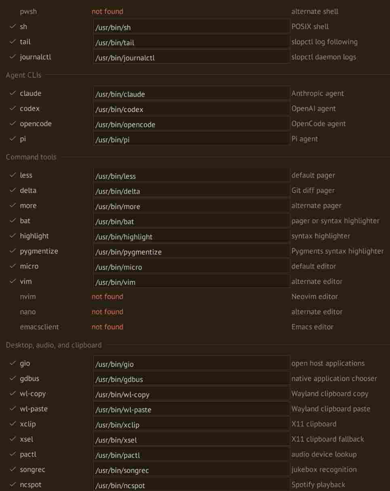
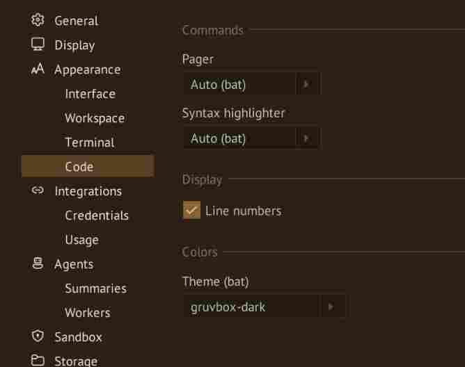
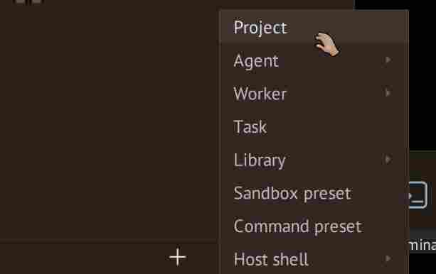
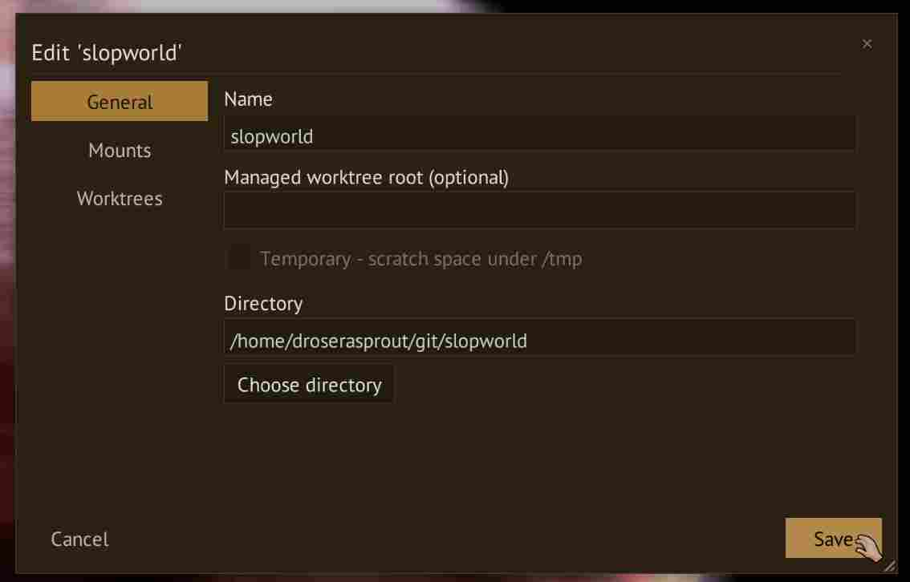

# Quickstart

A quick tour covering core concepts and usual workflow.

First, finish the [Installation](install.md) guide for native Linux, [macOS](../deployment/macos.md)
or [Sidecar](../deployment/sidecar.md) for other environments.

## Prepare your tools

Install the tools you want to use on the machine running the daemon.  In sidecar mode, that means inside the container. 

SlopWorld integrates with these tools to some extent:

- Agents: `codex`, `claude`, `pi`, `opencode`
- VCS: Git (`git`) for repositories and commits, and ripgrep (`rg`)
  for workspace text search.
- **Reading code and diffs:** `bat` for syntax-highlighted files, `less` for paging,
  and `delta` for Git diffs. Alternative highlighters include Pygments
  (`pygmentize`) and `highlight`.
- **Editing files:** `micro` is the default editor. Vim (`vim`), Neovim (`nvim`),
  Nano (`nano`), and Emacs (`emacsclient`) are also supported choices.
- **Shells:** Bash (`bash`) is the default. Zsh (`zsh`), Fish (`fish`), Nushell
  (`nu`), and PowerShell (`pwsh`) have integrations too.

If your favorite agent or tool is missing, it _doesn't_ mean it's not supported.  Create a custom app preset <link>

## Prepare the workspace

Launch with `slopworld`.

The sidebar holds your agents, files, and Git changes. Selecting an agent opens
its terminal. See the [interface tour](interface.md) for the other controls.
If the workspace cannot connect to the daemon, follow
[Troubleshooting](../help/troubleshooting.md).

Open **Settings > Commands > Binaries** to check which tools SlopWorld can find.
Choose your editor and reader tools under **Settings > Appearance > Code**;
see [Settings](../customization/settings.md#applying-changes) for automatic tool selection.

## Add a project

1. Open **+ > Project** in the sidebar.
2. Give the project a name and set its directory to the absolute path of your
   repository checkout on the machine running the daemon. In sidecar mode, use
   its path inside the container.
3. Save the project.

The project directory is writable by default. For additional paths or read-only
access, see [Configuring projects](../workspace/configuring-projects.md).

## Open a host shell

1. Save the project, then open **+ > Host shell** in the sidebar.
2. Select your project. A terminal opens in its directory.
3. Run `pwd` and `git status` to check the working directory and any existing
   changes before giving the agent a task.

This shell runs on the daemon host, outside the agent sandbox. In sidecar mode,
it runs inside the container. See [Host shells](../terminals/host-shells.md) for stopping,
restarting, and removing the terminal tab.

## Add an agent

1. Open **+ > Agent**. Choose a template for your CLI if available, or **Custom**.
2. Give the agent a name and select the project you just added.
3. Leave **Worktree** at **Main checkout**. Under **Command**, select the preset
   for your installed CLI. Leave **Command line override** and **Arguments** blank
   for this walkthrough.
4. Open **Preview** to inspect the settings and project mounts, then save.
5. Find the agent in the **Agents** tab. If it is **Down**, right-click its row
   and choose **Start**. Select the agent to open its terminal.

Complete any setup prompts shown by the CLI. If startup fails, use the error
message with [Troubleshooting](../help/troubleshooting.md). See
[Configuring agents](../agents/configuring-agents.md) for the remaining settings.

<!-- Manual screenshot: agent editor with project, Main checkout, and CLI selected.
     Caption: Choose the project and the CLI this agent will run. -->

## Give it a task

Enter a small request in the agent's terminal, for example:

> Inspect this project and create a short hello-world.md describing its contents
> and suggesting one small next step. Use Markdown headings and a bulleted list.
> Do not change any other files.

Interact with the CLI as you would in a normal terminal, including any approval
prompts. **Working** and **Idle** reflect terminal activity; an idle terminal
does not necessarily mean the task is finished.

<!-- Manual screenshot: agent terminal showing the request and completed response.
     Caption: Give your agent a small, concrete first task. -->

## Review the result

1. When the CLI reports completion, open **Git** and expand your project's
   checkout. Right-click `hello-world.md` and choose **Diff**. Read through the
   additions and check that the agent changed only the requested file.
   Review this file individually: **Diff all** does not include untracked files.
2. Open **Files**, expand the same project and checkout, and right-click
   `hello-world.md`. Choose **View** to open the rendered Markdown preview.
   Check that the headings and list render correctly and the text makes sense.
3. Return to **Git**, right-click `hello-world.md`, and choose **Stage**.
4. Open **Terminal (host)** from the checkout heading and run `git diff --cached`
   to check exactly what will enter the commit. Unstage unrelated files if needed.
5. Open the checkout heading's context menu, choose **Commit staged changes**,
   and enter a message such as `Add hello-world.md`. Select **Commit**.

See [Git](../workspace/review-changes.md) for the full review workflow and
[Files and search](../workspace/files-and-search.md) for browsing and editing.

<!-- Manual screenshot: Git view with the hello-world.md diff open.
     Caption: Read the additions before staging the agent's work. -->

<!-- Manual screenshot: rendered hello-world.md preview showing headings and a list.
     Caption: Check the finished document in the Markdown reader. -->

## Save your agent as a template

1. In **Agents**, right-click your working agent and choose **Edit**.
2. If you change any settings, save them and reopen the editor first.
   **Save as template** copies the agent's saved settings.
3. Select **Save as template**, name it `reviewer`, and select **Save**.
4. Open **Library** to find your new template. Click it to inspect or edit it.

The template reuses command and sandbox settings. It does not copy the agent's
conversation or credentials, or store the project's mounts. See
[Templates](../agents/configuring-agents.md#templates) for what is included.

<!-- Manual screenshot: Save agent as template dialog with the name reviewer.
     Caption: Turn a working agent configuration into a reusable template. -->

## Spawn a worker from the template

1. In **Agents**, right-click the **project heading** and choose **Spawn worker**.
2. Leave **Caller** set to **You (host)** and choose the `reviewer` template.
3. Under **Worktree**, select the existing main checkout for this read-only task.
4. Enter this assignment under **Task**:

   > Read hello-world.md and compare it with the project. Report anything
   > inaccurate or missing, and suggest one improvement. Do not edit files.

5. Leave **Keep worker after exit** enabled so you can inspect it afterward,
   then select **Spawn**. Its terminal opens automatically.

If you want an agent to spawn workers itself, add `reviewer` under
**Settings > Agents > Workers**. Spawning as **You (host)** can use any template
in the catalog. See [Agent collaboration](../agents/agent-collaboration.md) for
worker instructions and delegation.

<!-- Manual screenshot: Spawn worker with You (host), reviewer, main checkout,
     and the review assignment filled in.
     Caption: Give a worker a focused assignment using your saved template. -->

## Read the worker's report

Open **Tasks** in the sidebar and select the assignment to read its progress and
final report. Check that the task finishes; an **Idle** terminal alone does not
confirm completion. If the worker only replies in its terminal, check the initial
worker instructions under **Settings > Agents > Workers**: it needs to accept
and finish its assigned task using `slopctl`.

Read the suggested improvement and decide whether to give your original agent a
follow-up task. The retained worker remains available for inspection; remove it
when you are finished. For a worker that will edit files, choose a
[new worktree](../workspace/project-worktrees.md#create-and-use-a-worktree) when
spawning it, then review and commit its changes there.

<!-- Manual screenshot: Tasks view showing the completed review and final report.
     Caption: Follow the assignment through to a finished report. -->

## Continue

- [Interface](interface.md) introduces file browsing, search, and the workspace controls.
- [Sandboxing](../sandbox/sandboxing.md) explains the agent's access to your system.
- [Project worktrees](../workspace/project-worktrees.md) adds separate checkouts for parallel work.
- [Library items and errands](../workspace/library.md) saves reusable prompts and commands.
